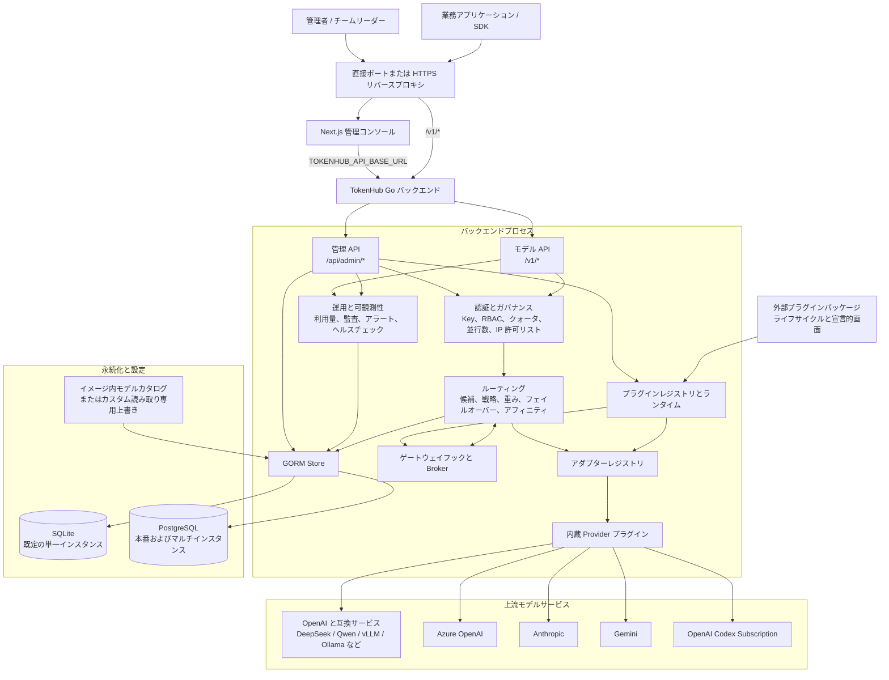
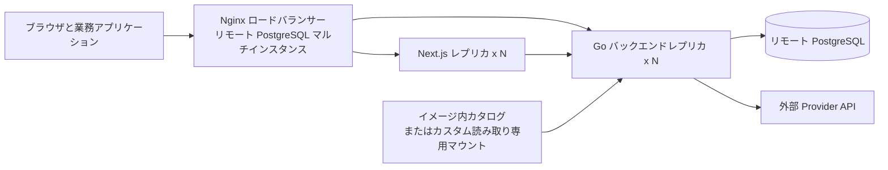
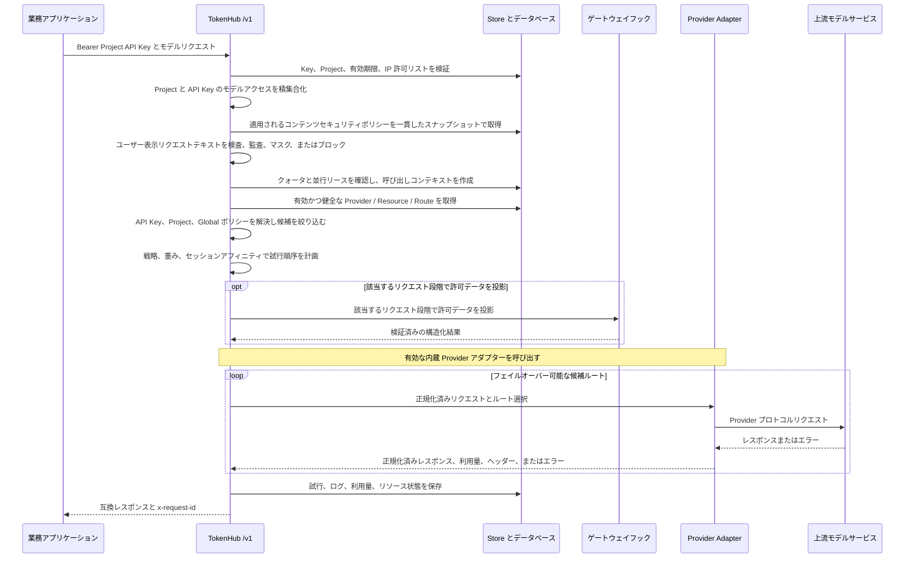

# TokenHub 全体アーキテクチャ

Language: [English](../architecture.md) | [简体中文](../zh-CN/architecture.md) | 日本語

このドキュメントは、開発、運用、セキュリティ担当者向けに、リポジトリで実装されている TokenHub のデプロイ形態、リクエスト経路、データ境界を説明します。TokenHub は SQLite による単一インスタンスを既定とし、PostgreSQL による単一インスタンスおよびリモート PostgreSQL を使うマルチインスタンスもサポートします。

## 概要

Go バックエンドの 1 プロセスで管理 API、OpenAI 互換モデル API、ルーティング、Provider アダプター、監査、永続化を提供します。Next.js は管理コンソールです。コントロールプレーンとデータプレーンは論理的な境界であり、既定構成では 1 つのバックエンドとデータベースを共有します。マルチインスタンス構成では PostgreSQL を介して状態を共有します。

バックエンドは Core、内蔵プラグイン、インストール可能な外部パッケージで構成されます。Core は公開 API の互換性、認証・認可、ルーティングの准入制御、永続化、計量、監査を担当します。内蔵プラグインは Provider、ゲートウェイ、ジョブ、Action の実行機能をプロセス内で提供します。外部パッケージが現在提供できるのは、検証済みメタデータと宣言的な画面だけで、実行エントリポイントは起動されません。

## プレーン

| プレーン | エントリーポイントと利用者 | 主な責務 | 現在の実装 |
| --- | --- | --- | --- |
| コントロールプレーン | 管理コンソールと `/api/admin/*` | Provider、リソース、モデル、ルート、Project、ユーザー、Key、クォータ、アラート、承認、バックアップの管理 | Next.js コンソールと Go 管理 API。状態は SQLite または PostgreSQL に保存 |
| データプレーン | 業務アプリケーションと `/v1/*` | Project API Key の検証、ルート選択、上流モデル呼び出し、互換レスポンスの返却 | Go `net/http`。Chat Completions、Responses、ストリーミング Responses、`/v1/responses/compact`、Embeddings |
| 運用プレーン | プローブ、管理 API、デプロイツール | リクエスト監査、利用量、ルート試行、Provider プローブ、バックアップ、クラスタ協調 | バックエンドプロセス内で実行。マルチインスタンスでは PostgreSQL に協調状態を保存 |

## デプロイ形態

| 形態 | Compose ファイル | サービスと入口 | データベースと用途 |
| --- | --- | --- | --- |
| 既定の単一インスタンス | `deploy/docker-compose.yml` | フロントエンド 1 台、バックエンド 1 台、`3000` と `8080` を直接公開 | SQLite。開発、テスト、単一ホストのプライベートデプロイ向け |
| PostgreSQL 単一インスタンス | `deploy/docker-compose.postgres.yml` | フロントエンド、バックエンド、ローカル PostgreSQL を各 1 台 | より高い並行性またはデータベース統制が必要な本番向け |
| リモート PostgreSQL マルチインスタンス | `deploy/docker-compose.remote-postgres.yml` | Nginx とスケール可能なフロントエンド/バックエンド | 高可用性と水平スケールのためのマネージド PostgreSQL |

既定 Compose にはリバースプロキシは含まれず、フロントエンドとバックエンドのポートを直接公開します。本番では外部で HTTPS を終端できます。リモート PostgreSQL 用 Compose には Nginx が含まれ、`/api/*`、`/v1/*`、`/livez`、`/readyz`、`/healthz` をバックエンドレプリカへ転送します。

既定イメージはビルド時に内蔵したモデルカタログを使用し、実行ファイルとカタログのバージョンを一致させます。カスタムカタログは `./deploy/install.sh --model-catalog /absolute/path/to/model-catalog.yaml` による明示的な上書きであり、既定の Compose マウントではありません。

## プラグインランタイムと境界

`backend/internal/server/plugin_bootstrap.go` は、プラグインレジストリ、ゲートウェイチェーンと実行器、管理 UI レジストリ、Action Broker、バックグラウンドジョブの Broker/Runner、アダプターレジストリを組み立てます。内蔵機能を登録し、`TOKENHUB_PLUGIN_DIR` のパッケージを検査して、対応済みの宣言的貢献を公開します。内蔵と外部のパッケージはメタデータと能力の契約を共有しますが、Go プロセス内で実行されるのは内蔵プラグインだけです。`stdio-json-v1` は Devkit と将来のランタイム契約を定義するもので、現行リリースで動作する外部実行経路ではありません。

| 能力面 | 実装入口 | 責務と境界 |
| --- | --- | --- |
| パッケージ契約と読み込み | `backend/internal/plugin/manifest.go`、`runtime.go`、`registry.go` | 登録前に manifest schema、Plugin API 互換性、権限、パッケージ状態を検証 |
| Provider | `backend/internal/server/provider_plugin_adapter.go`、`adapter_registry.go` | 内蔵アダプターが Provider・リソース・認証情報の投影を使って宣言された操作を呼び出す。ルーティングと計量は Core が担当 |
| ゲートウェイチェーン | `backend/internal/plugin/gateway_chain.go`、`gateway_runner.go`、`backend/internal/server/gateway_plugin_hooks.go` | プロセス内の各段階のフックに許可されたデータを渡し、構造化結果と変更範囲を検証 |
| バックグラウンドジョブと管理操作 | `backend/internal/plugin/background_scheduler.go`、`background_job.go`、`action_broker.go` | プロセス内ジョブの実行と管理操作を仲介。永続化されたバックグラウンド Responses ジョブとは別の仕組み |
| 画面 | `backend/internal/plugin/admin_ui.go`、`sim.go` | 宣言的なパネル、設定、テーマ、レイアウトをコンソールが描画。任意のプラグイン React や JavaScript は実行しない |

パッケージは `plugin.yaml` で manifest schema `2` と Plugin API `v2` を宣言します。schema `1` と API `v1` は互換アダプターを通じて引き続きサポートします。権限は将来の呼び出しに投影できる Core データと、Core が受け入れられる構造化変更を制限します。これは OS サンドボックスではありません。コマンドポリシーではネットワークとリソースの強制隔離は現在 `unsupported` です。そのため、ホストがプロセス、ネットワーク、リソースの隔離を強制できるようになるまで、TokenHub はフェイルクローズし、ランタイムから読み込まれた外部 Action、バックグラウンドジョブ、Provider コマンド、ゲートウェイコマンドをすべて起動前に拒否します。実行可能バックエンドエントリを持つ有効なパッケージは `failed_startup` として永続化され、インストール済みで検査可能なまま、ランタイム機能を一切公開しません。宣言的な画面だけを持つパッケージとプロセス内の組み込みプラグインには影響しません。汎用コマンドの制限は将来の実行契約として維持され、既定値は 30 秒、入力 4 MiB、出力 1 MiB です。各能力面には、ゲートウェイ Hook の既定 5 秒など、独自の制限もあります。外部コマンドが無効な間は、外部 Provider のストリーミングも利用できません。現在のプロトコル形態はイベント配列を記述するもので、子プロセス出力のライブ中継ではありません。

3 種類の Compose はいずれも `tokenhub-plugins` を `/app/plugins` にマウントし、`TOKENHUB_PLUGIN_DIR` と `TOKENHUB_PLUGIN_MARKETPLACE_URL` を提供します。ファイルとライフサイクル状態はファイルシステムに保存され、レジストリと実行器はプロセスごとに保持されます。プラグインのライフサイクル操作はリクエストを処理したサーバープロセスのランタイムをホットリロードするため、パッケージ検証、宣言的貢献の変更、ライフサイクル失敗の表示にサービス再起動は不要です。リロードは外部コマンドパッケージを評価しますが、実行可能にはしません。PostgreSQL はプラグインバイナリの配布や全レプリカのレジストリ更新を行わないため、複数インスタンス構成ではパッケージバージョンを揃え、各レプリカをリロードする必要があります。

インストールとマーケットプレイスのコードには、チェックサム検証、署名付きマーケットプレイスの信頼検証、権限レビュー、失敗したパッケージの隔離、ロールバック経路があります。これらは全レプリカの原子的な有効化やホストリソースの隔離を保証しません。詳細な契約とライフサイクル操作は[プラグイン開発ガイド](plugin-development/README.md)を参照してください。

## コンポーネントと Provider

| コンポーネント | 場所 | 責務 |
| --- | --- | --- |
| 管理コンソール | `frontend/` | ロール対応コンソール。バックエンド URL は実行時に `TOKENHUB_API_BASE_URL` から読み取り、`NEXT_PUBLIC_API_BASE_URL` は互換フォールバックのみ |
| HTTP サーバー | `backend/internal/server/http.go` | API、認証、ルーティング呼び出し、レスポンス、ヘルスエンドポイント |
| ルーティング | `backend/internal/server/http.go` | 優先度、リソース優先度、戦略、重み、アフィニティによる候補の順序付け |
| アダプターレジストリと統合サービス | `adapter_registry.go`、`integration_service.go` | Provider 能力の宣言と Provider/リソースのプローブ |
| Provider アダプター | `builtin_provider_plugins.go`、`provider_plugin_adapter.go`、`provider_account_codex.go` | プロトコル変換、Codex Subscription の OAuth、更新、セッションアフィニティ |
| Store | `store.go` | GORM、クォータ、認証情報暗号化、SQLite バックアップ、PostgreSQL リース、クラスタロック |

以下は現在動作する内蔵 Provider 登録です。実際の能力は有効な内蔵プラグインとアダプターの記述、Provider ポリシー、モデルとリソースの対応状況で決まります。外部 manifest はパッケージ検査と Devkit 契約テスト用に追加の Provider 型を記述できますが、現行 TokenHub リリースはコマンド型アダプターを有効化しません。

| Provider 型 | アダプターと能力 |
| --- | --- |
| `openai` | Chat、ストリーミング Chat、Responses、ストリーミング Responses、Embeddings、プローブ、画像生成 |
| `openai_compatible`、`deepseek`、`qwen`、`local` | OpenAI 互換操作。モデルと Provider ポリシーによって Responses 対応を制限可能 |
| `kronk` | Chat、ストリーミング Chat、Responses、ストリーミング Responses、Embeddings、モデル検出、プローブ |
| `azure_openai` | Chat、ストリーミング Chat、Embeddings、プローブ |
| `anthropic` | Chat、ストリーミング Chat、プローブ |
| `gemini` | Chat、ストリーミング Chat、Embeddings、プローブ |
| `openai_codex` | Responses、ストリーミング Responses、モデル、プローブ、クォータ、OAuth、セッションアフィニティ、Compact、画像生成 |
| `mock` | ローカル検証とテスト |

Provider インベントリはチーム所有をサポートします。Provider 行が `owner_team_id` を持つ場合、プラットフォーム管理者と所有チームのリーダーのみがそのチャネルとリソースを管理できます。プロバイダー管理のすべての書き込み経路でこの所有権が強制されます。ルーティングも同じ所有権を継承します。ルートは作成者が管理できるプロバイダーのみを参照でき、ルートプランナーの候補フィルターはチーム所有チャネルを主チームが一致するプロジェクトにのみ提供するため、同一の外部モデル名をプラットフォームチャネルと複数チームのチャネルに安全にマッピングできます。

## モデルリクエスト経路

以下は Core のリクエストフローの概要です。該当する段階で実行器が登録済みフックに許可されたデータを投影し、Core が処理を続ける前に結果を検証します。フック段階はプライバシーとガードレール、コンテキストとキャッシュ、候補選択と順位付け、リクエスト・レスポンス変換、利用量、精算、トレース出力を含みます。段階の宣言は全エンドポイントやインストール済みプラグインの実装を意味せず、各エンドポイントの対応状況と段階の規則が適用されます。

`Model` は外部 API 契約、`ProviderModel` は 1 つの Provider に対する永続化された上流モデルインベントリ、`ModelRoute` はその間のマッピングです。外部モデルには明示的で永続化されたディレクトリロールが付くため、最後のルートを削除しても候補テンプレートへ戻らず、下書きとして残ります。ルートの作成または編集では、選択した `ProviderModel` がインベントリに存在する必要があります。限定的な例外は、サブスクリプション型仮想モデル `codex-gpt-image-2` です。このルートは OpenAI Codex Provider を対象とし、上流モデルを `gpt-image-2` に固定する必要があります。これはチャットモデルのインベントリ項目ではなく、実行能力です。これにより、同名 1:1 マッピングとカスタムエイリアスの両方を支持し、呼び出し側は Provider 固有のモデル名を意識しません。`POST /v1/chat/completions`、`POST /v1/responses`、`POST /v1/responses/compact`、`POST /v1/embeddings` は同じ認証、クォータ、ルーティング入口を共有します。

非アクティブまたは不健全な Provider、Resource、Route は除外されます。ただし例外として、クールダウンが満了した Resource はハーフオープン候補として再び候補に加わります。最初に到達したリクエストがクールダウン期限を前方へ進めることで試行権を取得するため、同時実行のリクエストは引き続き拒否され、試行が失敗した場合は次のより長いウィンドウがすでに設定されています。その試行自身が成功した場合にのみブレーカーが閉じ、管理者の操作なしに Resource が復旧します。ブレーカー作動時にすでに実行中だったリクエストが Resource を復活させることはありません。失敗が繰り返される場合は `TOKENHUB_RESOURCE_COOLDOWN_MAX_SECONDS` を上限として指数的にウィンドウが延長されます。管理者が無効化した Resource が再び組み入れられることはありません。非ストリーミング呼び出しは候補を順番に試行します。出力開始後のストリームは安全に上流を切り替えられません。ストリーミング Responses には `responses_stream` 能力を持つアダプターが必要です。`openai_codex` のルートでは、リクエストと API Key からセッションアフィニティキーを導出し、継続性のために Resource バインドを永続化できます。

`background: true` を設定した `POST /v1/responses` では、同期リクエストフローは認証と永続化された投入の後で終了します。各レプリカは起動時にキューが空でも永続キューを継続して poll します。Worker はジョブを取得して元の認可を再検証し、admitted phase、request ID、quota counter、token reservation、concurrency lease を同じデータベース transaction で commit してから、同じ guardrail、routing、Provider、metering、audit、trace のフローへ入ります。lease epoch が古い Worker を fence します。PostgreSQL の複数レプリカは row lock と `SKIP LOCKED` で取得し、SQLite は対応対象の単一バックエンド構成で原子的に取得します。Admission 前の lease 喪失は安全に再実行できます。Admission 後の lease 喪失は Provider への重複リクエストを避けるため明示的な終端状態となり、未 dispatch の token reservation は復旧時に返却されます。

Project と API Key のモデルアクセスはルート選択前の明示的な最小権限レイヤーです。制限リストは積集合化され、制限かつ空リストはすべてを拒否し、レガシーの空モードは継承のままです。スコープルーティングポリシーは、`routing-policies` kind の監査可能な `AdminResource` として保存されます。実行時は厳密な API Key → Project → Global の優先順位で最大 1 つのバインドを選び、その Provider、Resource、Model、タグ、リージョン、環境の制約をルートの Project スコープと積集合化します。無効、競合、または候補が空の上位バインドはフェイルクローズします。戦略の上書き、アフィニティ、ハーフオープン復旧、フェイルオーバーは絞り込み後の候補内でのみ動作します。有効ポリシー ID、スコープ、優先度はリクエスト監査レコードにコピーされます。

## セキュリティ、ヘルス、データ境界

- Project API Key はハッシュ、状態、Project 状態、有効期限、モデル範囲、IP 許可リスト、クォータ、並行数で検証されます。
- 管理 API はログインセッション Token または任意の `TOKENHUB_ADMIN_TOKEN` を使用します。`TOKENHUB_BOOTSTRAP_ADMIN_PASSWORD` が設定されている場合は初期 `admin` アカウントに使用し、未設定の場合は TokenHub がパスワードを生成します。取得可能な暗号化コピーは、初回ログイン成功後またはリセット後に削除されます。
- 開発以外の環境では、任意のブートストラップ認証情報にある既知のプレースホルダーを無効化し、それ以外の空でない弱い値を拒否します。`TOKENHUB_SECRET_KEY` は引き続き必須ですが、新規のファイル型 SQLite データベースに限り、データベースの隣に永続キーファイルを生成できます。既存データベースに代替キーを自動生成することはありません。
- `TOKENHUB_TRUSTED_PROXY_CIDRS` は `X-Forwarded-For`、`X-Forwarded-Host`、`X-Forwarded-Proto` を提供できるプロキシを限定し、信頼済みプロキシはこれらのヘッダーを上書きする必要があります。`TOKENHUB_CORS_ALLOWED_ORIGINS` は資格情報を伴うブラウザ Origin を制御します。
- `/livez` はプロセス生存確認用です。`/readyz` と互換用の `/healthz` はデータベース可用性とデータベース進化状態を確認し、データベースが利用できない場合、マイグレーションが不完全な場合、台帳検証が失敗した場合、ブロッキングデータバックフィルが未完了の場合に `503` を返します。保留中のオンラインバックフィルは準備状態を維持します。起動構成が安全でない場合も `/livez` だけが正常となり、構成を修正して再起動するまで readiness とアプリケーションルートは `503` を返します。

Provider 認証情報、請求コネクター認証情報、生の請求スナップショット、永続化されたバックグラウンド Responses payload は `TOKENHUB_SECRET_KEY` から導出した AES-GCM で暗号化されます。Project API Key は SHA-256 ダイジェストと表示用のプレフィックス/サフィックスだけを保持します。すべてのレプリカは同じ安定したシークレットを使用する必要があります。

| カテゴリー | 主なエンティティ | 用途 |
| --- | --- | --- |
| テナントと認証情報 | `Project`、`APIKey`、`AdminUser`、`AdminSession` | Project 所有、アプリケーションアクセス、管理セッション |
| ルーティング | `Provider`、`ProviderResource`、`ProviderModel`、`Model`、`ModelRoute`、`AdminResource (routing-policies)` | 上流チャネル、リソースプール、上流インベントリ、外部モデル、ルート、スコープポリシーバインド |
| コンテンツセキュリティ | `guardrails.Policy`、`guardrails.DetectionItem`、`guardrails.Binding` | Project 単位のリクエスト検査、検出器設定、アクション、ポリシーバインド |
| ガバナンスと計量 | `QuotaBucket`、`UsageRecord`、`ProviderResourceBucket`、`InFlightLease` | クォータ、利用量/コスト、レプリカ間並行数 |
| 外部請求 | `BillingConnector`、`BillingRecord`、`BillingRawSnapshot`、`BillingSyncRun` | Provider 請求の収集、正規化、チェックポイント、同期履歴 |
| マルチインスタンス協調 | `ClusterLease`、`ClusterTaskState`、`AdapterSessionBinding` | カタログ同期、クラスタ操作、Codex セッションの Resource バインド |
| バックグラウンド Responses | `ResponseJob`、`ResponseJobEvent` | 暗号化されたリクエストと結果の保持、fencing された実行状態、キャンセル、期限切れ、状態遷移監査 |
| 可観測性 | `RequestLog`、`RequestPayloadLog`、`RouteAttemptLog`、`ProviderObservation`、`AuditEvent` | リクエスト追跡、ペイロード監査、ルート試行、Provider 観測、管理監査 |

SQLite は単一接続と 5 秒の `busy_timeout` を使用し、バックエンドレプリカ間で共有してはなりません。PostgreSQL はコネクションプール、マイグレーション用 advisory lock、実行中リース、クラスタロックを提供します。内蔵バックアップ API は SQLite 専用です。PostgreSQL では `pg_dump` と `pg_restore` などのプラットフォーム機能を使用してください。

デプロイは Redis、メッセージブローカー、サービスメッシュに依存しません。同期リクエストとレスポンスのペイロードは監査用に記録される場合があるため、本番では保持期間、最小権限、ディスク暗号化、バックアップアクセス制御を適用してください。永続化されたバックグラウンド Responses は平文の payload 監査と trace export から除外され、その内容は TTL 付きの暗号化ジョブレコードだけに保持されます。

## 関連ドキュメント

- [デプロイ](deployment.md)：デプロイ形態、環境変数、リバースプロキシ、ヘルスチェック。
- [PostgreSQL 設定ガイド](../postgresql-setup.md)：PostgreSQL の設定、運用、移行。
- [管理者ガイド](administrator-guide.md)：Provider、ルート、アクセス制御、監査、コスト統制。
- [プラグイン開発](plugin-development/README.md)：Plugin Devkit、Examples、プラグインファミリー、Manifest 契約、runtime 面、移行チェックリスト。
- [利用者ガイド](user-guide.md)：Project API Key とモデル API 呼び出し。
- [チームリーダーガイド](team-leader-guide.md)：チーム、Project、メンバー、コスト配賦。
