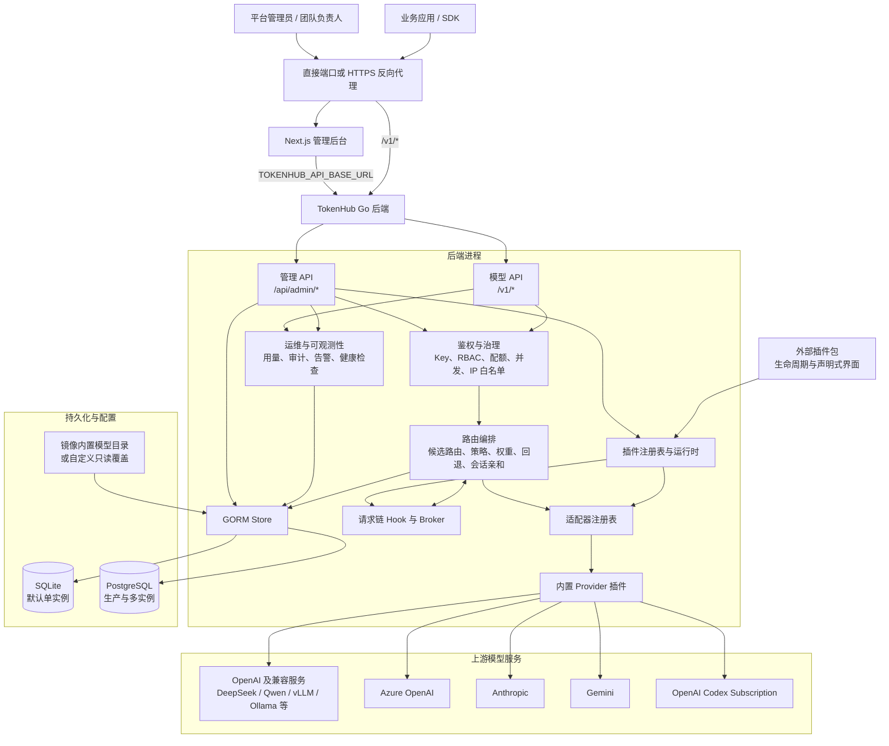
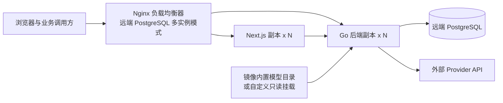
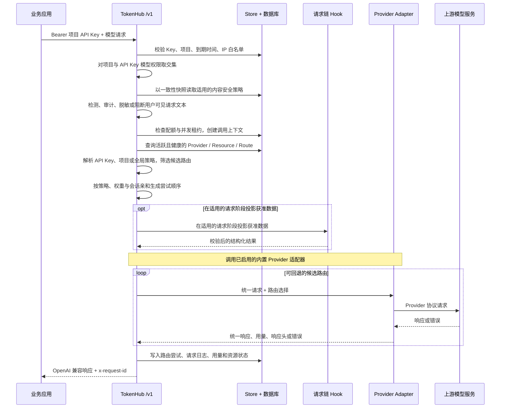

# TokenHub 整体架构

Language: [English](../architecture.md) | 简体中文 | [日本語](../ja/architecture.md)

本文描述当前仓库已经实现的 TokenHub 架构，供开发、运维和安全人员理解部署形态、请求链路与数据边界。TokenHub 默认采用 SQLite 单实例部署，同时支持 PostgreSQL 单实例和基于远端 PostgreSQL 的多实例部署。

## 架构概览

后端是一个 Go 进程，承载管理 API、OpenAI 兼容模型 API、路由编排、Provider 适配、审计和持久化逻辑。前端是 Next.js 管理后台。控制面与数据面是逻辑边界；默认部署中它们共享一个后端实例和数据库，多实例模式则通过 PostgreSQL 共享状态。

后端由 Core、内置插件和可安装外部包组成。Core 保留公共 API 兼容、认证授权、路由准入、持久化、计量和审计职责。内置插件在进程内提供可执行的 Provider、请求链、任务和 Action 能力。外部包当前只提供经过校验的元数据和声明式界面；其可执行入口不会启动。

## 平面划分

| 平面 | 入口与使用者 | 主要职责 | 当前实现 |
| --- | --- | --- | --- |
| 控制面 | 管理后台与 `/api/admin/*` | Provider、资源、模型、路由、项目、用户、Key、配额、告警、审批和备份管理 | Next.js 控制台 + Go 管理 API，状态保存到 SQLite 或 PostgreSQL |
| 数据面 | 业务应用与 `/v1/*` | 验证项目 API Key，选择可用路由，调用上游模型，返回兼容响应 | Go `net/http` 服务，支持 Chat Completions、Responses、Responses 流式、`/v1/responses/compact` 和 Embeddings |
| 运维面 | 探针、管理 API、部署工具 | 请求审计、用量、路由尝试、Provider 探测、备份与集群协调 | 与后端同进程；多实例时由 PostgreSQL 持久化协调状态 |

## 部署形态

| 形态 | 编排文件 | 服务与入口 | 数据库与适用边界 |
| --- | --- | --- | --- |
| 默认单实例 | `deploy/docker-compose.yml` | 一个前端和一个后端，直接发布 `3000`、`8080` | SQLite，适合开发、测试和单机私有化部署 |
| PostgreSQL 单实例 | `deploy/docker-compose.postgres.yml` | 一个前端、一个后端和一个本地 PostgreSQL 容器 | PostgreSQL，适合需要更高并发或数据库治理的生产部署 |
| 远端 PostgreSQL 多实例 | `deploy/docker-compose.remote-postgres.yml` | Nginx 网关、可横向扩展的前端和后端副本 | 托管 PostgreSQL，适合高可用与水平扩展 |

默认 Compose 不包含反向代理，直接发布前端和后端端口。生产环境可在外部部署 HTTPS 反向代理；远端 PostgreSQL 多实例编排则内置 Nginx，并将 `/api/*`、`/v1/*`、`/livez`、`/readyz` 和 `/healthz` 转发到后端副本。

默认镜像直接使用构建时内置的 `model-catalog.yaml`，以保证后端程序和模型目录版本一致。需要自定义目录时，通过 `./deploy/install.sh --model-catalog /absolute/path/to/model-catalog.yaml` 显式覆盖；该文件不是默认 Compose 挂载项。

## 插件运行时与边界

`backend/internal/server/plugin_bootstrap.go` 统一装配插件注册表、请求链及执行器、管理 UI 注册表、Action Broker、后台任务 Broker/Runner 和适配器注册表。启动时注册内置能力，检查 `TOKENHUB_PLUGIN_DIR` 中的插件包，并发布受支持的声明式贡献。内置与外部包共享元数据和能力契约，但只有内置插件在 Go 进程内执行。`stdio-json-v1` 定义的是 Devkit 与未来运行时契约，并非当前版本可用的外部执行路径。

| 能力面 | 实现入口 | 职责与边界 |
| --- | --- | --- |
| 插件包契约与加载 | `backend/internal/plugin/manifest.go`、`runtime.go`、`registry.go` | 注册前校验 manifest schema、Plugin API 兼容性、权限和包状态 |
| Provider | `backend/internal/server/provider_plugin_adapter.go`、`adapter_registry.go` | 内置适配器使用 Provider、资源和凭证的数据投影调用声明的操作；路由与计量仍由 Core 负责 |
| 请求链 | `backend/internal/plugin/gateway_chain.go`、`gateway_runner.go`；`backend/internal/server/gateway_plugin_hooks.go` | 在进程内向各阶段 Hook 提供获准数据，校验结构化结果并限制可修改内容 |
| 后台任务与管理动作 | `backend/internal/plugin/background_scheduler.go`、`background_job.go`、`action_broker.go` | 调度进程内任务并代理管理员操作；与持久化后台 Responses 任务分开 |
| 界面 | `backend/internal/plugin/admin_ui.go`、`sim.go` | 由控制台渲染声明式面板、设置、主题和布局；不执行任意插件 React 或 JavaScript |

插件包通过 `plugin.yaml` 声明 manifest schema `2` 和 Plugin API `v2`；schema `1` 与 API `v1` 仍通过兼容适配器支持。权限决定未来调用时可投影哪些 Core 数据，以及 Core 可接受哪些结构化修改。这不等同于操作系统沙箱：命令策略当前将网络和资源强制隔离标记为 `unsupported`。因此，在宿主机能够强制执行进程、网络和资源隔离前，TokenHub 会采取失败关闭策略，在启动前拒绝所有由运行时加载的外部 Action、后台任务、Provider 命令和请求链命令。带可执行后端入口的启用包会持久化为 `failed_startup`，保持已安装且可检查，但不会发布任何运行时能力。纯声明式界面包和进程内置插件不受影响。通用命令限制仍属于未来执行契约：默认超时 30 秒、输入上限 4 MiB、输出上限 1 MiB，各能力面还可使用自己的限制，例如请求链 Hook 默认 5 秒。外部命令禁用期间，外部 Provider 流式调用同样不可用；当前协议形态描述的是事件数组，而不是对子进程输出的实时转发。

三种 Compose 编排均将 `tokenhub-plugins` 挂载到 `/app/plugins`，并提供 `TOKENHUB_PLUGIN_DIR` 和 `TOKENHUB_PLUGIN_MARKETPLACE_URL`。插件文件与生命周期状态保存在文件系统，注册表和执行器则属于各进程。插件生命周期操作会热加载处理该请求的服务进程，因此包校验、声明式贡献变更和生命周期失败呈现无需重启服务。热加载会评估外部命令包，但不会使其变为可执行。PostgreSQL 不负责分发插件二进制，也不会刷新所有副本的注册表；多实例部署仍需协调插件版本，并逐副本执行热加载。

安装与市场代码提供校验和验证、签名市场信任校验、权限审查、失败插件隔离和回滚路径。这些机制不代表已实现跨副本原子激活，也不提供宿主资源隔离。详细契约和生命周期操作见[插件开发指南](plugin-development/README.md)。

## 关键组件

| 组件 | 位置 | 责任 |
| --- | --- | --- |
| 管理后台 | `frontend/` | 分角色控制台；服务端运行时通过 `TOKENHUB_API_BASE_URL` 读取后端地址，`NEXT_PUBLIC_API_BASE_URL` 仅作兼容回退 |
| HTTP 服务 | `backend/internal/server/http.go` | 注册 API、执行鉴权、路由调用、写入响应和健康检查 |
| 路由编排 | `backend/internal/server/http.go` | 为统一模型名选择候选路由，按优先级、资源优先级、策略、权重和亲和性确定尝试顺序 |
| 适配器注册与探测 | `adapter_registry.go`、`integration_service.go` | 声明各 Provider 的能力，执行 Provider 与资源探测 |
| Provider 适配层 | `builtin_provider_plugins.go`、`provider_plugin_adapter.go`、`provider_account_codex.go` | 将统一请求转换为上游协议；管理 Codex 订阅资源的 OAuth、刷新与会话亲和 |
| 持久化层 | `store.go` | GORM 数据访问、配额计数、凭证加密、SQLite 备份、PostgreSQL 租约和集群锁 |
| 模型目录 | `data/model-catalog.yaml` | 为镜像构建提供标准模型元数据，启动时同步到数据库 |

Provider 类型与主要能力如下：

下表列出当前可运行的内置 Provider 注册项。实际能力由启用的内置插件与适配器描述、Provider 策略以及模型和资源支持共同决定。外部 manifest 可以为包检查和 Devkit 契约测试描述额外 Provider 类型，但当前 TokenHub 版本不会激活其命令型适配器。

| Provider 类型 | 适配器与能力 |
| --- | --- |
| `openai` | Chat、流式 Chat、Responses、流式 Responses、Embeddings、探测和图像生成 |
| `openai_compatible`、`deepseek`、`qwen`、`local` | OpenAI 兼容操作；模型与 Provider 策略可进一步限制 Responses 支持 |
| `kronk` | Chat、流式 Chat、Responses、流式 Responses、Embeddings、模型发现和探测 |
| `azure_openai` | Chat、流式 Chat、Embeddings、探测 |
| `anthropic` | Chat、流式 Chat、探测 |
| `gemini` | Chat、流式 Chat、Embeddings、探测 |
| `openai_codex` | Responses、流式 Responses、模型发现、探测、额度、OAuth、会话亲和、Compact 和图像生成 |
| `mock` | 本地验证与测试 |

Provider 清单支持团队归属：某条 Provider 记录可以携带 `owner_team_id`，此时只有平台管理员与归属团队的负责人可以管理该渠道及其资源。渠道管理的全部写入路径都会强制校验归属。路由继承同一套归属规则：路由只能引用创建者有权管理的渠道，路由规划器的候选过滤会把团队自有渠道只提供给主团队匹配的项目，因此同一个外部模型名可以安全地同时映射到平台渠道与多个团队的渠道。

## 模型请求链路

下图概括 Core 请求流程。在适用的阶段，请求链执行器向已注册 Hook 投影获准数据，并在 Core 继续执行前校验结果。Hook 阶段覆盖隐私与内容安全、上下文与缓存、候选选择与排序、请求响应转换、用量、结算和追踪导出。声明了阶段不代表每个端点或已安装插件都实现了相应能力；仍以端点支持和阶段规则为准。

`Model` 是对外 API 契约，`ProviderModel` 是某个 Provider 下持久化的上游模型库存，`ModelRoute` 在两者之间建立映射。对外模型带有明确且持久化的目录角色，因此删除最后一条路由后会保留为草稿，而不会重新变成候选模板；创建或编辑路由时，所选 `ProviderModel` 必须已经存在于库存中。唯一的窄例外是订阅制虚拟模型 `codex-gpt-image-2`：它的路由必须指向 OpenAI Codex Provider，并固定使用上游模型 `gpt-image-2`；这是执行能力，不属于聊天模型库存。这既支持同名 1:1 映射，也支持自定义别名，调用方无需感知具体 Provider 模型名。`POST /v1/chat/completions`、`POST /v1/responses`、`POST /v1/responses/compact` 和 `POST /v1/embeddings` 都遵循相同的鉴权、配额与路由起点。

路由筛选会跳过非活跃或不健康的 Provider、Provider Resource 和 Route，但有一个例外：冷却期已过的资源会作为半开候选重新进入候选池。第一个选中它的请求通过把冷却截止时间向后推进来占用这次试探，因此并发请求仍会被拒绝，而试探失败时下一个（更长的）冷却窗口已经就位。只有该次试探自身成功才会关闭熔断器并自动恢复资源，无需管理员介入——熔断触发时已经在途的请求无法把资源救活；反复失败则按指数退避加长窗口，上限为 `TOKENHUB_RESOURCE_COOLDOWN_MAX_SECONDS`。被管理员禁用的资源永远不会被重新纳入。非流式调用依次尝试候选路由。已开始输出的流无法安全切换到另一条上游路由；Responses 流式仅选择声明 `responses_stream` 能力的适配器。对于 `openai_codex` 路由，系统可根据请求与 Key 派生会话亲和键，并持久化资源绑定以保持会话连续性。

对于设置 `background: true` 的 `POST /v1/responses`，同步请求链路会在认证和持久化提交后结束。每个副本即使在启动时队列为空，也会持续轮询持久化队列。Worker 领取任务并重新验证原始授权后，会在同一个数据库事务中提交 admitted 阶段、请求 ID、配额计数、Token 预留与并发租约，再进入相同的 Guardrail、路由、Provider、计量、审计和链路追踪流程。租约代次用于隔离过期 Worker。PostgreSQL 多实例通过行锁和 `SKIP LOCKED` 领取任务；SQLite 在受支持的单后端部署中通过原子操作领取。准入前的租约丢失可安全重放；准入后的租约丢失会进入明确终态，避免重复请求 Provider，尚未分发的 Token 预留会在恢复时退还。

项目与 API Key 的模型访问是路由选择前的显式最小权限层：限制列表互相取交集，限制且空列表禁止全部模型，而旧记录的空模式仍保持继承。作用域路由策略以 `routing-policies` 种类的可审计 `AdminResource` 记录保存。运行时按 API Key → 项目 → 全局的严格优先级最多选择一个绑定，然后将其 Provider、资源、模型、标签、地域和环境约束与路由项目作用域取交集。已停用、冲突或候选为空的高优先级绑定会安全拒绝。策略覆盖、亲和、半开恢复和故障转移只在筛选后的候选中运行。有效策略 ID、作用域与优先级会复制到请求审计记录。

## 鉴权、网络与健康检查

- 业务调用使用项目 API Key：后端校验摘要、状态、项目状态、过期时间、模型范围、IP 白名单、配额和并发。
- 管理调用使用管理员登录生成的会话 Token，或可选的 `TOKENHUB_ADMIN_TOKEN`。配置 `TOKENHUB_BOOTSTRAP_ADMIN_PASSWORD` 时，初始 `admin` 用户使用该密码；未配置时由 TokenHub 自动生成，首次成功登录或重置密码后会删除可查询的密文副本。
- 非开发环境会禁用可选引导凭据的已知占位值，并拒绝其他非空弱值。`TOKENHUB_SECRET_KEY` 仍为必填项；仅全新文件型 SQLite 数据库可以在数据库旁生成持久密钥文件，已有数据库不会自动生成替代密钥。
- `TOKENHUB_TRUSTED_PROXY_CIDRS` 限定哪些代理可提供 `X-Forwarded-For`、`X-Forwarded-Host` 和 `X-Forwarded-Proto`，可信代理必须覆盖这些请求头；`TOKENHUB_CORS_ALLOWED_ORIGINS` 限定允许携带浏览器凭证的 Origin。反向代理部署必须正确配置这两项。
- `/livez` 只用于进程存活探针；`/readyz` 以及兼容的 `/healthz` 会检查数据库可用性与数据库演进状态：数据库不可用、迁移处于脏状态、账本校验失败，或阻塞型数据回填未完成时返回 `503`。待执行的在线回填不影响就绪状态。启动配置不安全时，也只有 `/livez` 保持正常，所有就绪探针和业务接口都会返回 `503`，直至修正配置并重启进程。

Provider API Key、Provider Resource 凭证、账单连接器凭证、原始账单快照和持久化后台 Responses 载荷写入数据库前使用 `TOKENHUB_SECRET_KEY` 派生的 AES-GCM 密钥加密。项目 API Key 不保存原文，只保存 SHA-256 摘要以及用于展示的前缀和后缀。所有副本必须共享稳定的 `TOKENHUB_SECRET_KEY`，否则既有凭证和会话相关数据无法可靠使用。

## 数据与运行边界

| 类别 | 核心实体 | 用途 |
| --- | --- | --- |
| 租户与凭证 | `Project`、`APIKey`、`AdminUser`、`AdminSession` | 项目归属、调用权限与管理会话 |
| 路由配置 | `Provider`、`ProviderResource`、`ProviderModel`、`Model`、`ModelRoute`、`AdminResource (routing-policies)` | 上游渠道、资源池、上游模型库存、对外模型、路由规则和作用域策略绑定 |
| 内容安全 | `guardrails.Policy`、`guardrails.DetectionItem`、`guardrails.Binding` | 按项目执行请求检测，保存检测器配置、动作和策略绑定 |
| 治理与计量 | `QuotaBucket`、`UsageRecord`、`ProviderResourceBucket`、`InFlightLease` | 配额、Token 与成本计量、跨副本并发控制 |
| 外部账单 | `BillingConnector`、`BillingRecord`、`BillingRawSnapshot`、`BillingSyncRun` | 云厂商账单采集、规范化、同步断点和运行历史 |
| 多实例协调 | `ClusterLease`、`ClusterTaskState`、`AdapterSessionBinding` | 配置同步、集群操作与 Codex 会话资源绑定 |
| 后台 Responses | `ResponseJob`、`ResponseJobEvent` | 加密请求与结果保留、带隔离的执行状态、取消、过期和状态转换审计 |
| 可观测性 | `RequestLog`、`RequestPayloadLog`、`RouteAttemptLog`、`ProviderObservation`、`AuditEvent` | 请求追踪、载荷审计、路由尝试、Provider 观测与管理审计 |

SQLite 使用单连接和 5 秒 `busy_timeout`，适合单实例；不得让多个后端实例共享 SQLite 文件。PostgreSQL 支持连接池、迁移咨询锁、请求并发租约和集群锁，供多实例共享状态。内置备份 API 仅适用于 SQLite；PostgreSQL 应使用数据库平台的备份与恢复机制，例如 `pg_dump` 和 `pg_restore`。

当前部署不依赖 Redis、消息队列或服务网格。同步请求与响应载荷可用于审计，生产环境应结合保留策略、最小权限、磁盘加密和备份访问控制评估隐私风险。持久化后台 Responses 不会写入明文载荷审计或链路追踪导出，其内容只保留在受 TTL 约束的加密任务记录中。

## 相关文档

- [部署](deployment.md)：三种部署形态、环境变量、反向代理和健康检查。
- [PostgreSQL 设置指南](../postgresql-setup.md)：PostgreSQL 配置、运维和迁移。
- [管理员指南](administrator-guide.md)：Provider、路由、访问控制、审计和成本治理。
- [插件开发](plugin-development/README.md)：Plugin Devkit、Examples、插件家族、Manifest 契约、运行时能力面和迁移清单。
- [普通用户指南](user-guide.md)：项目 API Key 与模型 API 调用方式。
- [团队负责人指南](team-leader-guide.md)：团队、项目、成员和成本归因管理。
